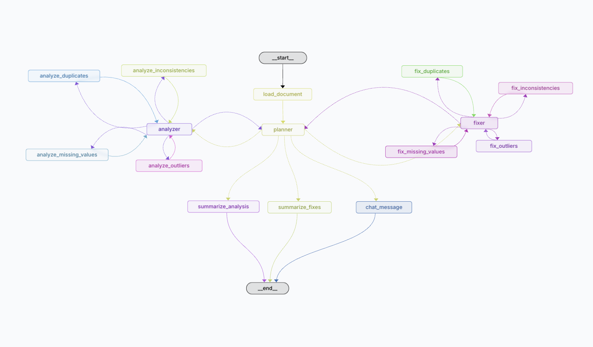

# AI Document Assistant

An AI-powered document processing and data cleaning assistant built with LangGraph and Streamlit.

## Features

- 🔍 Automatic detection of data quality issues
- 🧹 Clean missing values, outliers, and duplicates
- 📊 Generate data quality reports
- ⬇️ Download your cleaned dataset

## Architecture

This application consists of two main components:

1. **LangGraph Backend**: AI agent system handling document processing and analysis
2. **Streamlit Frontend**: User interface for document upload and interaction

### Document Processing Workflow

The document analysis and cleaning process follows this workflow:



## Cloud Deployments

### LangGraph Cloud

The application uses LangGraph for agent orchestration and is deployed at:
```
https://awesome-doc-agent-4aea3ef58f0f58c9b577c1f02420ef02.us.langgraph.app
```


